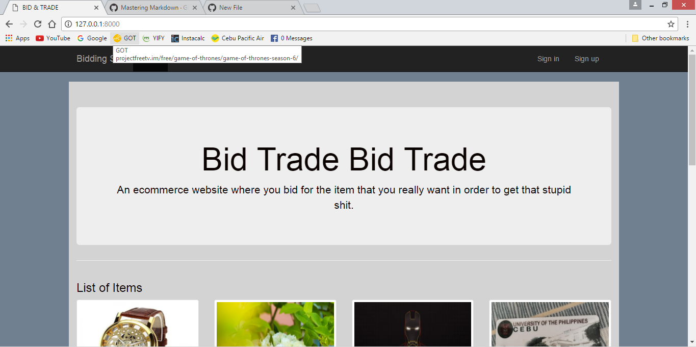

# **Bid-Trade**
Bid-Trade is a website that enables you to look for certain items that you want and in order to get them, you bid for them. In this website, you can also sell items.

## **How to run the project**
##### 1.(install django) -pip install django
##### 2.(migrate) -python manage.py migrate
##### 3.(runserver) -python manage.py runserver

## **Features**
### Sign up
### Sign In
### Home
###### This is where you can see the items
### Add Item
###### add the item you wanted to sell/trade
### Add Money
###### "Deposit" money
### Bid
###### A feature that enables you to bid for an item. Many users can bid for a single item.

#### The user can only bid/add item/add money if he/she has signed in. The user can view the items even if he/she didn't sign in.
##### by Ronald J. del Rosario & Trinity A. Quirante

